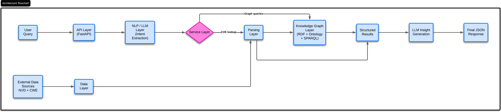
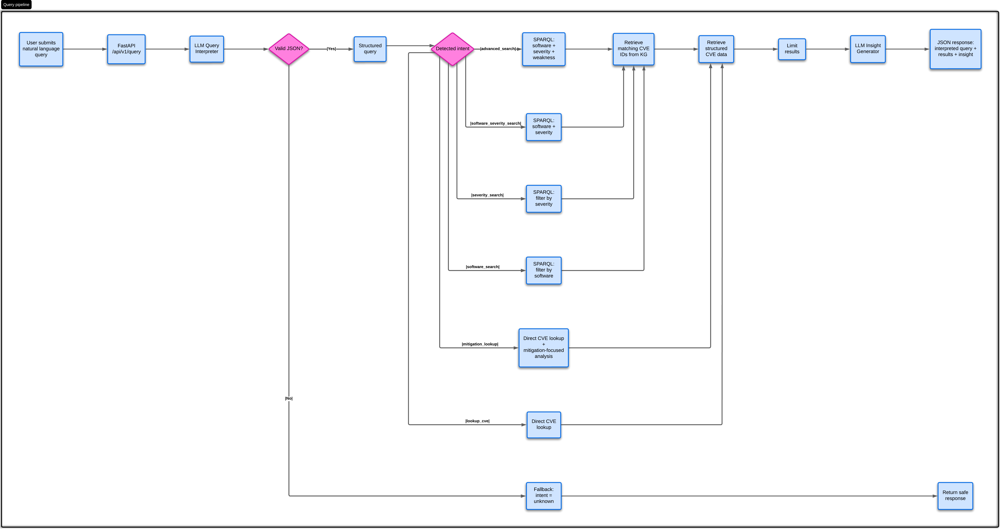

## Description of the Project

This is a web service that enables natural language querying of cybersecurity vulnerabilities by combining large 
language models with a knowledge graph.
The system integrates data from the National Vulnerability Database (NVD) and the Common Weakness Enumeration (CWE), 
and transforms them into a structured RDF knowledge graph that models relationships between vulnerabilities (CVEs), 
software products, weaknesses (CWEs), and external references using a custom ontology.
With the use of an API it is possible to submit queries in natual language, which is interpreted using an LLM, translated 
into structured parameters, and executed as SPARQL queries over the knowledge graph. 
The retrieved results are returned as structured data (including CVE identifiers, severity, affected products, and weaknesses), 
and are further used to generate concise, grounded insights through the LLM. 
The full ssystem is packaged in a Docker container for portability.

## System Architecture

This project is designed as a modular system, where each component is responsible for a specific part of the pipeline, 
from data ingestion to query execution and response generation. 
This separation makes the system easier to understand, extend, and debug.

The architecture is organized into the following layers:

* Data Layer: This layer is responsible for loading vulnerability data from external sources, specifically the NVD and the CWE. It handles raw data ingestion and basic preprocessing.
* Parsing Layer: The parsing step transforms the raw input data into a consistent internal format. Since NVD and CWE have different structures, this layer normalizes the data so it can be used uniformly across the system.
* Knowledge Graph Layer: In this layer, the normalized data is converted into an RDF knowledge graph based on a custom ontology. It defines entities such as vulnerabilities, software products, and weaknesses, and enables querying through SPARQL.
* NLP / LLM Layer: This component handles natural language understanding. It takes user queries and translates them into structured parameters (intent, software, severity, etc.). It is also used later to generate concise, human-readable insights from the retrieved data.
* Service Layer: The service layer acts as the central coordinator of the system. Based on the interpreted query, it decides whether to perform a direct lookup or a knowledge graph query, and combines the retrieved data with LLM-based reasoning.
* API Layer: The API layer exposes the system through a FastAPI web service. It provides endpoints for querying vulnerabilities and serves as the entry point for user interaction.



## Dataset

The project uses two cybersecurity data sources:

### National Vulnerability Database (NVD)

NVD provides concrete vulnerability records identified by CVE IDs. Each CVE entry may include descriptions, 
CVSS severity metrics, affected products encoded as CPE strings, weakness identifiers, and external references.

Example fields used from NVD:

- `id`
- `descriptions`
- `metrics`
- `weaknesses`
- `configurations`
- `references`

The `configurations` field contains CPE matches, which are used to extract affected software products.

### Common Weakness Enumeration (CWE)

CWE provides a classification of software and hardware weakness types. Unlike NVD, CWE does not describe individual 
vulnerabilities, but categories of weaknesses such as integer overflow, SQL injection, or cross-site scripting.

The project uses CWE fields such as:

## CWE Dataset Fields

| Field | Description |
|---|---|
| **CWE-ID** | Unique numeric identifier for the weakness (e.g. CWE-79) |
| **Name** | Short descriptive name of the weakness |
| **Weakness Abstraction** | Granularity level: Pillar, Class, Base, or Variant |
| **Status** | Record maturity: Draft, Stable, Incomplete, Deprecated |
| **Description** | Brief summary of what the weakness is |
| **Extended Description** | In-depth explanation with additional context |
| **Related Weaknesses** | CWEs that are parent, child, or peer of this entry |
| **Weakness Ordinalities** | Role of the weakness: Primary or Resultant |
| **Applicable Platforms** | Languages, OS, or technologies where it applies |
| **Background Details** | Extra background useful to understand the weakness |
| **Alternate Terms** | Other names or terms used to refer to the weakness |
| **Modes Of Introduction** | Development phases where the weakness can be introduced |
| **Exploitation Factors** | Conditions that make exploitation easier |
| **Likelihood of Exploit** | How likely the weakness is to be exploited (Low/Med/High) |
| **Common Consequences** | Security impact: confidentiality, integrity, availability |
| **Detection Methods** | Techniques to detect the weakness (static analysis, fuzzing…) |
| **Potential Mitigations** | Recommended fixes and best practices |
| **Observed Examples** | Real-world CVEs linked to this weakness |
| **Functional Areas** | Software areas involved (auth, crypto, memory mgmt…) |
| **Affected Resources** | Resources at risk: memory, files, network, CPU |
| **Taxonomy Mappings** | Mappings to OWASP, CERT, WASC and other standards |
| **Related Attack Patterns** | Associated CAPEC attack patterns |
| **Notes** | Additional notes or editorial comments |


# Query Processing Pipeline


## 1. Natural Language Interpretation (LLM)

User queries are first interpreted using an LLM via a structured prompt:

    You are a cybersecurity query interpreter.

    Return ONLY valid JSON.
    Do not use markdown.
    Do not use code fences.

    Schema:

    {{
      "intent": "lookup_cve | mitigation_lookup | severity_search | software_search | software_severity_search | advanced_search | unknown",
      "cve_id": string or null,
      "software": string or null,
      "severity": "CRITICAL | HIGH | MEDIUM | LOW" or null,
      "weakness": string or null,
      "wants_mitigation": boolean
    }}

    User question:
    {question}

The LLM extracts structured intent and entities from the user question.

Example:
```json
    {
      "intent": "advanced_search",
      "software": "nats-server",
      "severity": "HIGH",
      "weakness": "CWE-190"
    }
```


## 2. Parsing and Fallback

The LLM output is parsed into JSON.

If parsing fails, the system returns a safe fallback:
```json
    {
      "intent": "unknown",
      "cve_id": null,
      "software": null,
      "severity": null,
      "weakness": null,
      "wants_mitigation": false
    }
```

## 3. Intent-Based Execution

Based on the interpreted intent, different execution paths are triggered:

### 3.1 CVE Lookup

When a specific CVE identifier is present, the system performs a direct lookup in the internal dataset.

In this case, the knowledge graph is not used, as the CVE ID already uniquely identifies the vulnerability.

The execution steps:

1. Retrieve the vulnerability from the dataset using the CVE ID  
2. Generate a short technical explanation of the vulnerability  
3. Produce a concise natural language answer using the LLM  

This strategy is efficient and avoids unnecessary graph queries.

---

### 3.2 Mitigation Lookup

Mitigation queries are handled as a variation of CVE lookup, with a focus on remediation-related information.

Execution steps:

1. Retrieve the vulnerability using the CVE ID  
2. Extract relevant information from:
   - description  
   - references (patches, advisories)  
   - version constraints  
3. Generate a mitigation-oriented explanation using the LLM  

It is important to note that the NVD dataset does not provide structured mitigation fields.  
Therefore, mitigation insights are inferred only from explicit evidence present in the data, without introducing 
external knowledge.

---

### 3.3 Advanced Search

For queries involving multiple constraints (e.g. software, severity, weakness), the system relies on the knowledge graph.

Execution steps:

1. Decompose the query into individual constraints
2. Execute graph-based queries for each constraint
3. Combine results using set intersection:

CVE ∈ Software ∩ Severity ∩ Weakness  

This approach allows flexible _multi-dimensional_ filtering without hardcoding query logic.

---

### 3.4 Software Search

When the query specifies only a software product, the system retrieves all vulnerabilities affecting that product via the knowledge graph.

Execution steps:

1. Match product names using SPARQL (case-insensitive)  
2. Retrieve associated CVEs  
3. Generate a summarized answer  

---

### 3.5 Severity Search

When only a severity level is specified, the system retrieves all vulnerabilities matching that severity by using _knowledge graphs_.

Execution steps:

1. Query the knowledge graph for CVEs with the given severity  
2. Aggregate results  
3. Generate a concise summary  

---

### 3.6 Software + Severity Search

For queries combining software and severity, the system performs a constrained _knowledge graph_ search.

Execution steps:

1. Retrieve CVEs affecting the specified software  
2. Filter by severity  
3. Return intersected results  

---

### 3.7 Fallback / Unknown Intent

If the query cannot be reliably interpreted, the system returns a safe fallback response:
```json
{
  "intent": "unknown"
}
```

This prevents system failure and ensures robustness against ambiguous or malformed queries.




## Knowledge Graph and Ontology

The project makes use of a knowledge graph to integrate and structure vulnerability data coming from heterogeneous sources. 
As said before, the graph combines information from the National Vulnerability Database (NVD) and the Common Weakness 
Enumeration (CWE).

The two datasets serve different but complementary purposes. NVD provides concrete vulnerability instances identified by 
CVE IDs, including descriptions, severity scores, affected software products, and references. In contrast, CWE defines a 
taxonomy of weakness types, such as integer overflows or injection flaws, which describe the underlying causes of 
vulnerabilities rather than specific incidents.

Instead of relying on a shared primary key, the integration is achieved through semantic relationships. 
Each CVE entry in NVD is linked to one or more CWE identifiers via the hasWeakness relation. This allows the system to 
connect individual vulnerabilities to their broader weakness categories, enriching the data with additional meaning.

A custom ontology was defined to model the domain. The main classes include:

* Vulnerability (representing CVE entries)
* SoftwareProduct (derived from CPE identifiers)
* Weakness (representing CWE entries)
* Reference (external resources such as advisories or patches)

These classes are connected through object properties such as:

* affects (linking a vulnerability to a software product)
* hasWeakness (linking a vulnerability to a CWE category)
* hasReference (linking a vulnerability to external resources)

Additionally, datatype properties such as hasSeverity, hasScore, and description are used to attach literal values to vulnerabilities.

The resulting knowledge graph enables multi-dimensional queries that go beyond simple filtering. 
For example, it becomes possible to retrieve vulnerabilities affecting a given software product, constrained by severity 
level and categorized by a specific type of weakness. This would be difficult to achieve with a purely tabular representation.


## Answer Generation (LLM)

A second LLM call generates a concise and grounded answer.
The key design choices are to use only retrieved data to avoid hallucination,
compresses results into a small context and focuses on the most important aspects.

Prompt structure:

    You are a cybersecurity assistant.
    Answer the user's question using ONLY the retrieved results below.
    Do not invent facts.
    Your answer must add value beyond simply repeating the raw results.
    Focus on:
    - the number of matching vulnerabilities
      - the main shared properties
      - important differences between the results
      - any explicit fix, workaround, or exposure detail mentioned in the descriptions
    User question:
    {question}
    Interpreted query:
    {json.dumps(interpreted_query, ensure_ascii=False)}
    Retrieved results:
    {json.dumps(compact_results, ensure_ascii=False, indent=2)}
    Write 2 to 4 short sentences in plain English.
    Do not use markdown.


## API Endpoints


### 1. GET /

This endpoint acts as a simple health check to verify that the service is running correctly.

Response example:
```json
    {
      "message": "CyberGraph API is running"
    }
```


### 2. GET /vulnerabilities/{cve_id}

This endpoint retrieves structured information for a specific vulnerability identified by its CVE ID.

Example:

    GET /vulnerabilities/CVE-2019-13126

Behavior:

* Looks up the CVE directly in the internal dataset
* Returns all available structured fields (description, severity, products, etc.)
* Returns a 404 error if the CVE is not found


### 3. POST /query

This is the main entry point of the system. It allows users to submit queries in natural language.

Request body:
```json
    {
      "question": "Show me high severity vulnerabilities affecting nats-server with CWE-190"
    }
```
Behavior:

1. The query is interpreted by the LLM
2. The intent and parameters are extracted
3. The appropriate execution strategy is selected (lookup or knowledge graph query)
4. Results are retrieved and combined with an LLM-generated insight

Response example:
```json
    {
      "interpreted_query": {
        "intent": "advanced_search",
        "software": "nats-server",
        "severity": "HIGH",
        "weakness": "CWE-190"
      },
      "count": 2,
      "results": [...],
      "insight": "There are two high-severity vulnerabilities affecting nats-server..."
    }
```
## How to Run


### Environment Variables

The system currently uses CampusAI to access a Large Language Model.  

However, the design is modular and it is possible to switch to a different LLM provider by modifying the `campus_ai_api` module.

To run the project, you must provide your API key using a `.env` file as shown below, in the root of the project:

```env
CAMPUSAI_API_KEY=your_api_key_here
CAMPUSAI_MODEL="Gemma 4"
```


---

## Run Locally

1. Activate the virtual environment:

```bash
source .venv/bin/activate
```

2. Start the API server:

```bash
uvicorn app.main:app
```

3. Open in browser:

- API root: http://127.0.0.1:8000  
- Swagger docs: http://127.0.0.1:8000/docs  

---

### Run with Docker

From the project root:

### 1. Build the image

```bash
docker build -t cybergraph -f docker/Dockerfile .
```

### 2. Run the container

```bash
docker run --env-file .env -p 8000:8000 cybergraph
```

The API will be available at:

```text
http://127.0.0.1:8000
```

---

## Run Tests

Install test dependencies (if not already installed):

```bash
pip install pytest
```

Run tests:

```bash
pytest
```

## Evaluation and Results

The system was mainly evaluated through manual testing and by checking whether the different components behaved as expected.
From a functional point of view, the API correctly handles different types of queries. Simple queries, such as retrieving a specific CVE, always return the expected result directly from the dataset. More complex queries, involving multiple constraints (e.g. software, severity, and weakness), were also tested and showed that the knowledge graph is working correctly, since the results match the intersection of the specified filters.
The natural language interface works well for common query patterns. The LLM is generally able to correctly identify the intent and extract the relevant parameters. For example, queries like “high severity vulnerabilities affecting nats-server with CWE-190” are correctly interpreted and translated into structured filters. However, more ambiguous or poorly phrased queries may lead to an “unknown” intent, which is handled safely by the fallback mechanism.
The generated insights are useful as a short summary of the results. Since the LLM is constrained to only use retrieved data, the answers remain consistent with the actual vulnerabilities and do not introduce incorrect information. The summaries typically highlight the number of results, shared characteristics, and relevant differences between vulnerabilities.
From a robustness perspective, the system behaves well even when the LLM output is not valid JSON. In these cases, the fallback logic prevents crashes and returns a safe response. This makes the system more reliable when dealing with unpredictable model outputs.
In terms of performance, the system handles a few thousand vulnerabilities without noticeable issues, as the graph is built in memory at startup. However, this approach would likely not scale to much larger datasets. For larger-scale use, a more efficient graph backend (such as QLever) would be preferable.